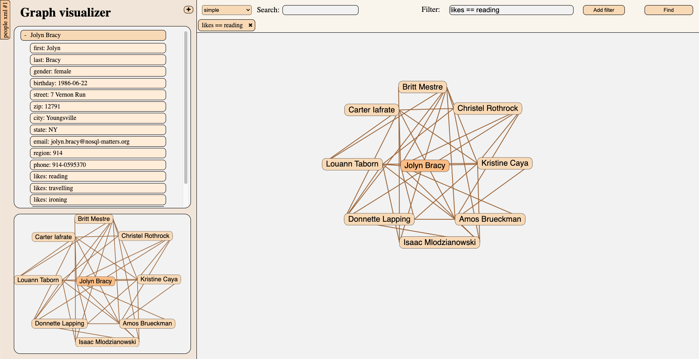

# Graph visualizer
This project is part of the coursework for the course "Softverski obrasci i komponente" (Software Patterns and Components) at [Faculty of Tehnical Sciences (University of Novi Sad)](https://www.ftn.uns.ac.rs/). The goal of the project is to apply the concepts learned during the course and showcase practical skills.

## Preview


## Software components

### Parsers
Parsers are components that convert data into a graph. In this project there are two types of parsers, json animal parser and xml people parser.

### Visualizers
Visualizers are components that display graph. In this project there are two types of visualizers, simple and block visualizer.

### Main Component
Main Component is the central view where the selected graph is displayed.

### Bird View
Bird View component is minimized graph visualization of main view. It contains viewport (rectangle) that moves according to the current viewport in the Main View.

### TreeView
Tree View (display of the graph in the form of a tree) enables actions for dynamically opening and closing nodes, modeled on the package explorer of well-known integrated development environments.

### Search And Filter
Search And Filter component lets the user search the graph and apply filters on the graph and as a result, displays a graph based on those criterias.

## Installation

### Open Terminal and position inside desired folder
```bash
cd folder_name
```

### Create virtual environment

#### For Windows users:
```bash
python -m venv venv
```
For activation run following command:
```bash
venv\Scripts\activate
```
#### For Linux and MacOS users:
```bash
python3 -m venv venv
```
For activation run following command:
```bash
source venv/bin/activate
```

### Clone this repository
```bash
git clone git@github.com:Olivera2708/Graph-visualizer.git
```

### Change location directory location
Change location directory location
```bash
cd Graph-visualizer
```

### Install all required packages
#### For Windows users:
```bash
python -m pip install -r requirements.txt
```
#### For Linux and MacOS users:
```bash
python3 -m pip install -r requirements.txt
```

### Run software
#### For Windows users:
```bash
.\run.bat
```
#### For Linux and MacOS users:
```bash
./run.sh
```

### Use software
Open your browser on [http://127.0.0.1:8000/](http://127.0.0.1:8000/) and start using it.

## Authors (Team 3)
* Miloš Bojanić - *SV9/2021* - [GitHub](https://github.com/milosbojanic)
* Olivera Radovanović - *SV46/2021* - [GitHub](https://github.com/Olivera2708)
* Sonja Parabucki - *SV34/2021* - [GitHub](https://github.com/Sonja-Parabucki)
* Vasilije Marković - *SV15/2021* - [GitHub](https://github.com/VasilijeMa)